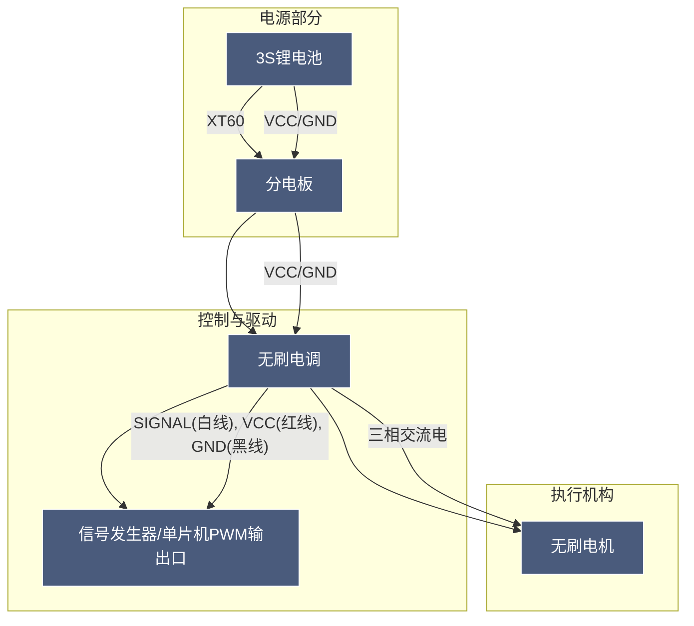

## 驱动电机
### 接线图



### 步骤

1. 按照接线图接线

2. 接入电源，此时电机没有接收到PWM信号，每经过3秒之后进行一次短鸣。除接收3秒以上的50% PWM信号之外，不对任何PWM输入做响应，处于电机保护状态。

3. 信号发生器输出500Hz，3秒以上50%的PWM信号，根据当前锂电池的节数短鸣 n 次(3S电池是3次)，再长鸣 1 次，表示初始化完成，解除电机保护，进入工作状态。

4. 在工作状态下接收50%到100%的PWM信号，控制电机由停转到最大转速之间变化。


> [!NOTE]
>
> 上电后如果有持续的两声短蜂鸣，说明电池电量不足，其他可参考说明书

### 测试代码

```c
HAL_TIM_PWM_Start(&htim4, TIM_CHANNEL_4);
HAL_Delay(4000);
for (int i = 0; i < 1000; i++) {
__HAL_TIM_SET_COMPARE(&htim4, TIM_CHANNEL_4, 1000 + i); // PB9对应TIM4的CH4
HAL_Delay(100);
}
```

### 效果展示

<video controls width="100%" >
  <source src="https://photos-1355819942.cos.ap-shanghai.myqcloud.com/undefined%E7%94%B5%E6%9C%BA%E8%BD%AC%E5%8A%A8.mp4" type="video/mp4">
  您的浏览器不支持视频播放，请升级浏览器或下载视频观看。
</video>

## 组装电机和螺旋桨

顺序：

电机->垫片->桨叶->子弹头/螺母

<video controls width="100%" >
  <source src="https://photos-1355819942.cos.ap-shanghai.myqcloud.com/undefined朗宇电机安装桨叶教程.mp4">
  您的浏览器不支持视频播放，请升级浏览器或下载视频观看。
</video>

<video controls width="100%" >
  <source src="https://photos-1355819942.cos.ap-shanghai.myqcloud.com/undefined启动.mp4">
  您的浏览器不支持视频播放，请升级浏览器或下载视频观看。
</video>

【龙翔LX450四轴无人机架组装教学视频】 https://www.bilibili.com/video/BV1TZ4y1W7RR/?share_source=copy_web
